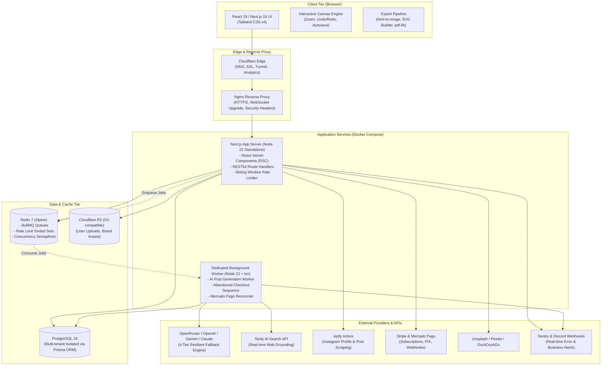

# zapost — Architecture & Engineering Showcase

> **High-Performance Multi-Tenant SaaS Platform for Visual Content Creation, Automated AI Generation, Distributed Asynchronous Queues & Multi-Format Vector Export.**

[](https://nextjs.org/)
[](https://react.dev/)
[](https://www.typescriptlang.org/)
[](https://tailwindcss.com/)
[](https://www.postgresql.org/)
[](https://www.prisma.io/)
[](https://redis.io/)
[](https://bullmq.io/)
[](https://www.docker.com/)
[](#)

---

## 📌 Overview

**zapost** is a full-stack, multi-tenant SaaS application engineered for high-precision visual social media publication creation (feeds, 3:4 carousels, and 9:16 stories). 

It combines an interactive client-side **HTML5 Canvas editor**, a **multi-format export pipeline** (raster PNG/JPEG/WebP, layered vector SVG, and multi-page vector PDF via `pdf-lib`), and an **automated AI generation engine** backed by a **4-tier LLM fallback pipeline** with **real-time web search grounding**.

Heavy computational workloads (batch post generation, abandoned checkout marketing sequences, and payment reconciliation) are decoupled from the HTTP cycle and processed by **distributed background workers** running on **BullMQ and Redis**.

> 🔒 *Note: This repository is a curated architectural and engineering showcase. Proprietary business logic, prompts, and credentials have been decoupled or sanitized. The technical documentation, distributed patterns, security models, and code samples below reflect the production architecture.*

---

## 🏛️ System Architecture



---

## ⚡ Key Engineering Highlights

### 1. Multi-Tenant Architecture & Data Isolation
* **Zero Cross-Tenant Leakage:** Every database query in the application is strictly scoped to the authenticated user's `tenantId` (`prisma.post.findFirst({ where: { id, tenantId } })`).
* **Strict API Mutation Pipeline:** All mutating endpoints (`POST`, `PATCH`, `DELETE`) follow an enforced 4-step execution flow:
  $$\text{CSRF Validation (Same-Origin)} \longrightarrow \text{Session Auth} \longrightarrow \text{Zod Validation} \longrightarrow \text{Tenant-Scoped DB Mutation}$$
* **Cascading Lifecycles:** Deletion of tenants cascades seamlessly across subscriptions, brand profiles, posts, media logs, and audit trails.

### 2. Distributed Queues & Asynchronous Workers (BullMQ + Redis)
* **Decoupled Job Lifecycle:** AI post generation runs asynchronously. The client enqueues a request (`POST /api/posts/generate`), receives an immediate `202 Accepted` with a `jobId`, and monitors progress via a non-blocking polling hook (`usePostGeneration`).
* **Resilient Job Retries:** Automatic exponential backoff retries (30s initial delay, max 2 retries) with custom retention policies (`removeOnComplete: 24h`, `removeOnFail: 48h`).
* **Dedicated Worker Container:** Background processing runs in an isolated container using `tsx` to execute TypeScript code directly without secondary compile steps.

### 3. Distributed Rate Limiting & Concurrency Control
* **Atomic Sliding Window Rate Limiter:** Protects sensitive endpoints (auth, generation, checkout) across multi-instance deployments using Redis Sorted Sets (`ZREMRANGEBYSCORE`, `ZCARD`, `ZADD`, `PEXPIRE`) in atomic pipelines.
* **Distributed Semaphore:** High-cost operations (such as AI caption generation) acquire atomic Redis lease tokens (`INCR`/`DECR`) with TTL fail-safes to prevent upstream LLM concurrency quotas from saturating.

### 4. 4-Tier Resilient AI Pipeline with Web Grounding
* **Cascading Fallback Mechanism:**
  * **Layer 1 & 2:** `openai/gpt-4o-mini` (fast baseline with intelligent retry on transient failures).
  * **Layer 3:** `google/gemini-2.0-flash-lite-001` (high-speed fallback).
  * **Layer 4:** `anthropic/claude-3.5-haiku` (robust final fail-safe).
* **Deterministic Structured Output:** Schema enforcement ensures strict JSON object responses across all provider models.
* **Real-time Web Grounding:** Integrated with **Tavily AI Search API** via heuristic analysis (`shouldUseWebSearch`) to pull real-time facts and citations for breaking news, trending topics, and market updates before prompting the LLM.

### 5. Browser Graphics Engine & Vector Export Pipeline
* **Zero UI Library Bloat:** Pure **Tailwind CSS v4** and CSS variables for theming (`#1f1f1e` dark theme base inspired by Claude.ai) with zero runtime styling overhead.
* **Complex Canvas State:** Custom hooks manage zoom (40%–240%), 30-step undo/redo history, and 2-second debounced autosave.
* **Multi-Format Export Engine:**
  * **Raster:** Client-side rendering to high-DPI PNG (1x/2x), JPEG (2x), and WebP via `html-to-image`.
  * **Layered Vector SVG:** Pure vector SVG generation preserving separate layers, text styling, background positioning, and color overlays.
  * **Vector Multi-Page PDF:** Asynchronous client-side PDF generation using `pdf-lib` and `@pdf-lib/fontkit` to embed custom TrueType/OpenType typography.
  * **Bulk Export:** In-memory ZIP compilation via `jszip` for batch slide downloading.

### 6. Dual Payment Processing & Growth Engineering
* **Stripe Subscriptions & Billing:** Complete lifecycle handling (Checkout Sessions, Customer Portal, plan upgrades/reactivations, and webhook events).
* **Mercado Pago (PIX & Card):** Seamless local payment processing with automated cron workers reconciling approved transactions every 10 minutes.
* **Conversion Tracking:** Server-side tracking via **Meta Conversions API (CAPI)** and **TikTok Conversions API (CAPI)** with SHA-256 client data hashing.
* **Lead Attribution & Recovery:** Full UTM tracking (`utm_source`, `utm_medium`, `utm_campaign`, `utm_content`), proprietary URL shortener, and an automated BullMQ multi-step email sequence recovering abandoned checkouts via **Resend**.

### 7. Enterprise Security Architecture
* **Strict Content Security Policy (CSP):** Configured in `next.config.ts` enforcing restricted script, frame, and connect origins, with dynamic Google Identity Services (GIS) / FedCM support.
* **Image Proxy with SSRF Defense:** `/api/image-proxy` validates and resolves remote URLs against private IP ranges (RFC 1918), loopback, link-local, and cloud metadata endpoints (`169.254.169.254`) with DNS pinning.
* **Cryptographic Standards:** Password hashing with `bcryptjs` (12 rounds) and single-use, time-limited SHA-256 password reset tokens.

---

## 📂 Repository Structure

```
zapost/
├── src/
│   ├── app/                      # Next.js 16 App Router (Pages & REST Route Handlers)
│   │   ├── (auth)/               # Local Auth, Google One Tap & Password Reset
│   │   ├── admin/                # Superadmin backoffice & metrics dashboards
│   │   ├── api/                  # 65+ secure RESTful endpoints
│   │   └── editor/               # Main canvas editor workspace
│   ├── features/                 # Domain-driven feature modules
│   │   ├── instagram-editor/     # Canvas engine, toolbars, color/font popovers
│   │   └── onboarding/           # Instagram profile import & brand setup
│   ├── lib/                      # Core architectural domains
│   │   ├── ai/                   # Multi-tier LLM gateway, prompts & Tavily search
│   │   ├── auth/                 # NextAuth v5, security headers & password hashing
│   │   ├── canvas/               # Canvas math, layout constants & export pipelines
│   │   ├── db/                   # Prisma client singleton & connection builder
│   │   ├── http/                 # SSRF validation & DNS pinning
│   │   ├── mercadopago/          # Mercado Pago client & activation logic
│   │   ├── meta/ & tiktok/       # Server-side Conversions API (CAPI) trackers
│   │   ├── observability/        # Sentry & Discord structured alert dispatchers
│   │   ├── queue/                # BullMQ connection & queue definitions
│   │   └── storage/              # Cloudflare R2 / AWS S3 client wrapper
│   └── workers/                  # Standalone background processes
│       ├── index.ts              # Worker orchestrator
│       ├── post-generation.ts    # AI generation worker
│       ├── abandoned-checkout.ts # Marketing recovery sequence
│       └── mp-reconciler.ts      # Payment reconciliation cron
├── prisma/
│   └── schema.prisma             # PostgreSQL schema (20+ models, relations & enums)
├── nginx/
│   └── zapost.conf            # Nginx reverse proxy configuration with HTTP/2 & SSL
├── Dockerfile                    # Multi-stage production build (Node 22 Alpine)
├── docker-compose.yml            # Multi-service stack (App, Worker, Postgres, Redis, Tunnel)
└── docs/                         # In-depth architectural technical documentation
```

---

## 🛠️ Tech Stack Matrix

| Category | Technologies |
|---|---|
| **Core Framework** | Next.js 16 (App Router, Standalone), React 19, TypeScript 5 |
| **Styling & UI** | Tailwind CSS v4, PostCSS, Custom CSS Variables (Zero UI library bloat) |
| **Database & ORM** | PostgreSQL 16, Prisma ORM 6 |
| **Cache & Distributed Queues** | Redis 7 (Alpine), BullMQ 5, ioredis |
| **Graphics & Export** | HTML5 Canvas, `html-to-image`, `pdf-lib`, `@pdf-lib/fontkit`, `jszip` |
| **AI & Search Engines** | OpenRouter, OpenAI (GPT-4o-mini), Gemini 2.0 Flash Lite, Claude 3.5 Haiku, Tavily API |
| **Payments & Monetization** | Stripe SDK, Mercado Pago SDK, Meta CAPI, TikTok CAPI |
| **Object Storage & CDN** | Cloudflare R2, AWS SDK v3 S3 Client (`@aws-sdk/client-s3`) |
| **Authentication & Security** | NextAuth.js v5, Google Identity Services (One Tap/FedCM), bcryptjs, Zod 4 |
| **Observability & Logging** | Sentry (`@sentry/nextjs`), Discord Webhooks, Resend |
| **DevOps & Infrastructure** | Docker, Docker Compose, Nginx, Cloudflare Tunnel, Certbot, GitHub Actions |

---

## 📖 Deep-Dive Architectural Documentation

Explore detailed breakdowns of specific systems:
* [01. System Architecture & Multi-Tenancy](./docs/01-system-architecture.md)
* [02. Distributed Queues, Workers & Rate Limiting](./docs/02-distributed-queues-and-resiliency.md)
* [03. 4-Tier AI Resiliency & Web Search Grounding](./docs/03-ai-orchestration-and-fallback.md)
* [04. Browser Graphics Engine & Vector Export](./docs/04-canvas-engine-and-vector-export.md)
* [05. Defensive Security, SSRF & Authentication](./docs/05-security-and-compliance.md)

---

## 💻 Curated Code Samples

Review production-grade sanitized implementations:
* [Sliding Window Rate Limiter (Redis Sorted Sets)](./code-samples/rate-limiter.ts)
* [Distributed Concurrency Semaphore](./code-samples/concurrency-semaphore.ts)
* [SSRF Defense & DNS Pinning Proxy](./code-samples/ssrf-defense.ts)
* [Multi-Tier AI Fallback Engine Pattern](./code-samples/ai-fallback-orchestrator.ts)
* [Multi-Stage Dockerfile & Docker Compose Stack](./code-samples/docker-compose.yml)

---

## 👨‍💻 Author

**Senior Full-Stack Software Engineer & Solutions Architect**
* Inquiries & Contact: [GitHub Profile](https://github.com/matheuszalax) | [LinkedIn](https://www.linkedin.com/in/matheus-almeida-gomes-0b6012150/)
* Demonstrations and walkthroughs available upon request.
